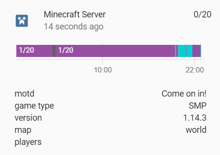

# MinecraftServer-HA
A component for reading Minecraft server stats and issuing commands using RCON! Based on the [awesome mcipc project](https://github.com/conqp/mcipc). <br>

 <br> <br>
[](https://www.buymeacoffee.com/JSz8KGIkD) <br> <br>

#### Important note
This component has only been tested with the Minecraft Java Edition servers - mileage may vary on altering versions

#### Install
Add the `minecraft` folder to your Home Assistant install in the `custom_components` directory and use this in your config:
```
minecraft:
  host: <IP_OF_MC_SERVER>
  query_port: <QUERY_PORT> # (Default: 25565)
  rcon_port: <RCON_PORT> # (Default: None)
  rcon_password: <RCON_PASSWORD> # (Default: None)
  icon: <ICON> # (Default: mdi:minecraft)
  name: <SENSOR_NAME> # (Default: Minecraft Server (sensor.minecraft_server))
  sensor: # List of default sensors
     - motd
     - game_type
     - version
     - map
     - players
```
<br>

Note: For this component to work you need to set `enable-query=true` in your Minecraft servers `server.properties` file. <br>
Enabling RCON is optional but it is required for some additional sensors and for the services to work. This is done in `server.properties` aswell.

#### List of available sensors
###### Query based metrics
The main portion of metrics come from the query calls. This component retrieves the `full_stats` client information including the following metrics: <br>
- `type` The packet type (Type, protocol information). <br>
- `session_id` The query's session ID (int, protocol information). <br>
- `host_name` The server's message of the day (str, same as BasicStats.motd). <br>
- `game_type` The game type (str). <br>
- `game_id` The game ID (str). <br>
- `version` The game version (str). <br>
- `plugins` The used plugins (dict). <br>
- `map` The current map (str). <br>
- `num_players` The amount of online players (int). <br>
- `max_players` The amount of maximally allowed players (int). <br>
- `host_port` The server's port (int). <br>
- `host_ip` The server's IP address (ipaddress.IPv4Address). <br>
- `players` The names of online players (tuple of str). <br> <br>

###### RCON based metrics
RCON metrics are retrieved from the server console itself, and therefore only a handful of metrics are picked out for time being: <br>
- `seed` The world seed. <br>
- `mansion_location` The next mansion location (X,Y,Z)

However it is possible to call any command from the console using the rcon `send_command` service. <br> <br>

#### Services (RCON required)
###### minecraft.send_command:
Executes any command on the Minecraft Server. Uses the service_data `command` and optionally `data`. <br><br>
###### minecraft.turn_off:
Sends a stop command to the server (without saving). <br><br>
###### minecraft.reload:
Sends a reload command to the server (Reloads loot tables, advancements, and functions from disk). <br><br>
###### minecraft.save:
Sends a save-all command to the server <br><br>
###### notify.minecraft_server:
Sends a message on your server. Takes service_data `message`, `title` (Name ingame, blank none, default: 'Home Assistant'), `target` (Receiving player(s). default: '@a') <br><br>
###### notify.minecraft_server_title:
Sends a title on your server. Takes service_data `message`, `title` (Style of title, `title` | `subtitle` | `actionbar`, default: 'title'), `target` (Receiving player(s). default: '@a')<br><br>

#### Legal
Minecraft content and materials are trademarks and copyrights of Mojang and its licensors. All rights reserved. This program is free software and is not affiliated with Mojang. <br>
